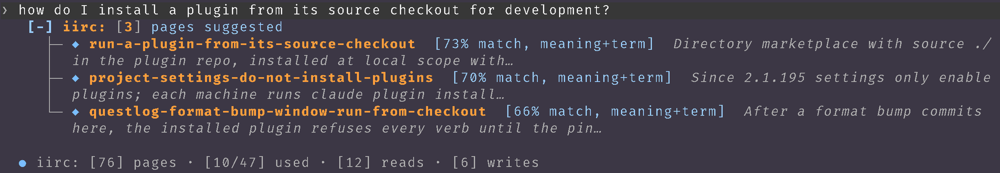

# What iirc draws for you

The hooks put lines into the agent's context that you never see. The
plugin's hooks module, `hooks/register.tsx`, catches each of those lines as
Claude Code stores it and draws it for you. It is on by default. It is
tested on Claude Code 2.1.295.



## Under your prompt

When recall finds pages for your prompt, a row appears under it:

```
[+] iirc: [3] pages suggested
```

Click anywhere on the row to open the list:

```
[−] iirc: [3] pages suggested
  ├─ ◆ run-a-plugin-from-its-source-checkout  [73% match, meaning+term]
  │  Directory marketplace with source ./ in the plugin repo, installed at
  │  local scope with…
  ├─ ◆ project-settings-do-not-install-plugins  [70% match, meaning+term]
  │  Since 2.1.195 settings only enable plugins; each machine runs claude
  │  plugin install…
  └─ ◆ questlog-format-bump-window-run-from-checkout  [66% match,
     meaning+term]  After a format bump commits here, the installed plugin
     refuses every verb until the pin…
```

That list came from the prompt "how do I install a plugin from its source
checkout for development?" in the agent-builder repository.

The diamond is in your theme's success color, green by default, or yellow
on a page iirc suspects is stale. The
bracket after the name says how the page matched:

| Label | Means |
|---|---|
| `[N% match, meaning+term]` | at least 66% close in meaning, and it shares a rare term with your prompt |
| `[N% match, meaning]` | at least 72% close in meaning, with no shared rare term |
| `[term match]` | found by a rare term alone; every page reads this way in keyword mode |

N is 100 less the semantic distance as a percentage. A rare term has
digits or punctuation in it, or is a word of five letters or more from the
page's name, title, or summary, and appears in under a third of the pages.
The agent sees the same label in its line.

Recall suggests up to 3 pages. `/iirc max-suggested N` changes that, from 1
to 10, and `/iirc max-suggested` prints the number. It is kept in
`~/.config/dokidlc-iirc/config.toml` as `max_suggested`, so it holds on
that machine.

## Under a command

A shell command that fails is searched with its error text, and the pages
it finds appear under it in the same form, as `pages suggested for this
error`. A command that failed twice and then worked gets a row saying the
agent was asked to write the fix as a page. When the command sits in a
folded group of tool calls, the rows appear under the group.

## The line under the prompt

Beside Claude Code's own hint, one line sums up iirc for the session:

```
● iirc: [76] pages · [2/5] used · [12] reads · [4] writes
```

| Part | Means |
|---|---|
| `●` | green when all is well; yellow when the session-start check has a warning, such as a suspect page or two pages that read as duplicates; red when iirc needs setup, an init, or a migration |
| `[76] pages` | the pages in every store |
| `[2/5] used` | of the pages recall suggested this session, how many were then read |
| `[12] reads` | different pages this session read with `iirc read` or `iirc pull` |
| `[4] writes` | different pages this session wrote |
| `· [keyword] mode` | shown only when search is not semantic: no embedding host, or the string fallback chosen at setup |
| `· run iirc doubt` | shown when the circle is yellow or red: the command that clears it |

The line updates after each `iirc read`, `pull`, `write`, `delete`, `sync`,
`migrate`, `setup`, `init`, and `doctor`, and after each recall. A status
line cannot carry color, so the line sits in the hint row.

`/iirc status off` hides it and `/iirc status on` brings it back;
`/iirc status` says which.

## A plain `/iirc`

A plain `/iirc` draws a card in place of its output row:

- the name, "If I Recall Correctly", and what the plugin does
- STATUS: a chip, `✔ all good`, `▲ needs a look`, or `✖` and the red
  state's name, with the command that fixes it; the card's border takes
  the same green, yellow, or red
- the session's counts: pages, used, reads, and writes
- RECALL HIT RATE: the share of suggested pages that were read, as a
  percentage and a bar that runs from red into green as it fills
- SETTINGS: the line under the prompt and the number of suggested pages,
  each with its value and the command that changes it
- ASK IN WORDS: `/iirc` followed by a request, such as
  `/iirc what do we know about ollama hangs?`, which goes to the skill

It costs no tokens: the plugin answers, and the skill does not load. The choice is kept in the plugin's own store, so
it holds on that machine.

## Toasts

The warnings from the session-start check come as a toast, once per
distinct set of warnings. So does the reminder at stop when a command
failed twice, then worked, and nothing was written.

## Switches in `.claude/iirc.toml`

```toml
ui = false          # draw none of the above (default: on)
show_hooks = true   # also print the raw text each hook gives the agent (default: off)
```

`show_hooks` is for debugging: it shows exactly what reached the model. A
file that holds only these keys keeps the default `.iirc/` store.
